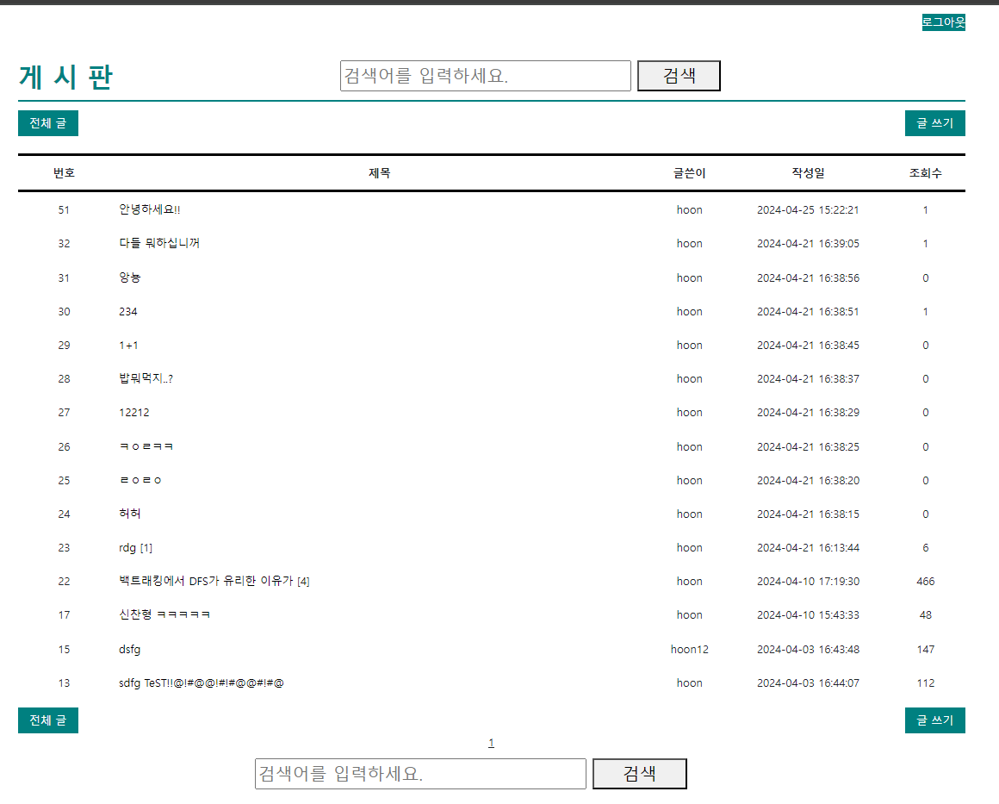
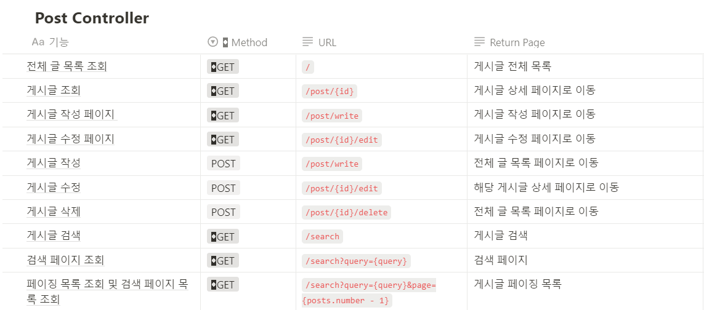
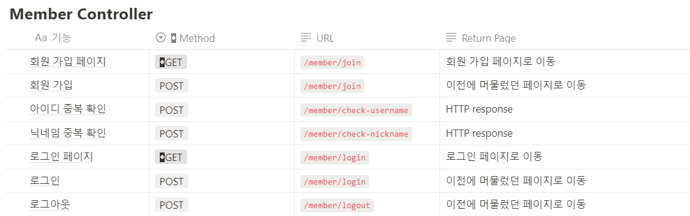
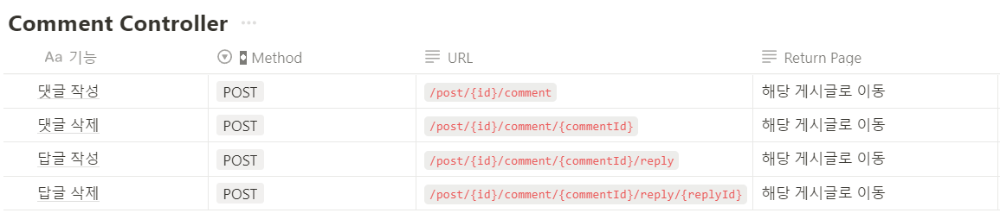
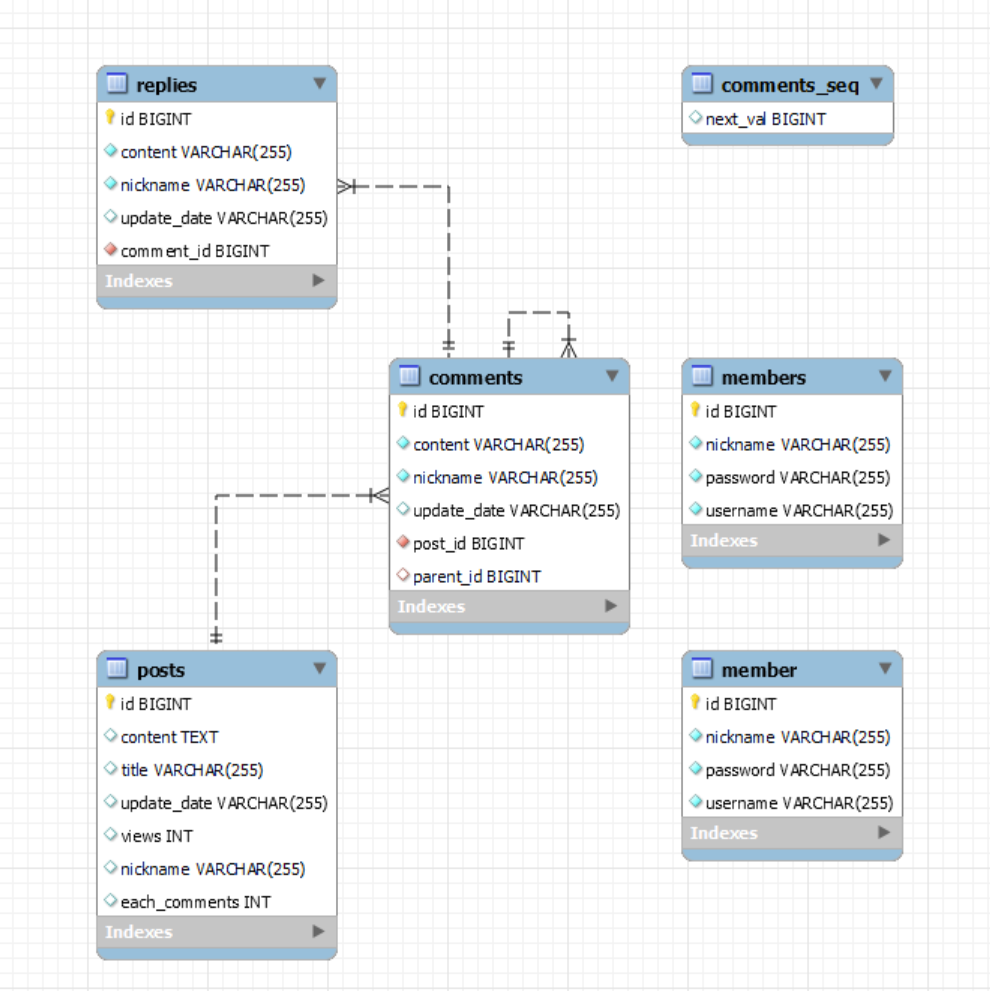

# 🥕 웹 게시판 프로젝트

- `Spring Boot`를 사용하여 커뮤니티 게시판을 구현하는 기본적인 웹 프로젝트입니다.

<br/>

# 📚 목차

- [프로젝트 소개](#프로젝트-소개)
- [프로젝트 구조](#프로젝트-구조)
- [기능](#기능)
- [개발 환경](#개발-환경)
- [기술 스택](#기술-스택)
- [API 설계](#API-설계)
- [DB 구조](#DB-구조)
- [보완 사항](#보완-사항)
- [후기](#후기)

<br/>
<br/>

# 1️⃣ 프로젝트 소개

- **프로젝트 명** : 커뮤니티 게시판 프로젝트


- **프로젝트 기간** : `2024.03.02 ~ 2024.04.27`


- **프로젝트 목적**
  - `Java`와 `Spring Boot`를 사용하여 게시판을 구현해보면서 웹 프로그래밍의 기초를 익히는 것을 목표로
    했습니다.
  - MVC 패턴을 이해하고, 데이터베이스와의 연동을 통해 데이터를 저장하고 조회하는 방법을 익히는 것을 목표로
    했습니다.

<br/>
<br/>

# 2️⃣ 프로젝트 구조 

## `📌Backend`


## `📌Frontend`


<br/>
<br/>

# 3️⃣ 개발 환경

- 
- 
- 
- 

<br/>
<br/>

# 4️⃣ 기술 스택

### 

 
<br/>
 
<br/>
<br/>

### 

  
<br/>
  
<br/>
<br/>
<br/>

# 5️⃣ 구현 기능 및 설명

## `📌 게시판 기능`

<details>
<summary> 전체 글 목록 조회 및 페이징 </summary>

- 모든 게시글을 조회하며, 한 페이지에 15개의 게시글이 보이도록 페이징 처리를 했습니다.
- 이전 및 다음, 그리고 페이지 번호를 클릭하여 해당 페이지로 이동할 수 있습니다.


<hr/>
</details>

<details>
<summary> 게시글 조회 </summary>

- 게시글의 제목을 클릭하면 해당 게시글을 상세히 확인할 수 있습니다.


<hr/>
</details>

<details>
<summary> 게시글 작성 </summary>

- 회원만이 게시글을 작성할 수 있습니다.
- 제목과 내용을 모두 작성해야만 하며, 작성 시간은 자동으로 기록됩니다.


<hr/>
</details>

<details>
<summary> 게시글 수정 </summary>
- 게시글 작성자와 회원만이 게시글을 수정할 수 있습니다.
- 게시글 수정 시에는 제목과 내용을 수정할 수 있습니다.


<hr/>
</details>

<details>
<summary> 게시글 삭제 </summary>

- 게시글 작성자와 회원만이 게시글을 삭제할 수 있습니다.


<hr/>
</details>

<details>
<summary> 제목 및 내용으로 게시글 검색 </summary>

- 제목 및 내용으로 게시글을 검색할 수 있습니다.


<hr/>
</details>

## `📌 사용자 기능`
<details>
<summary> 회원 가입 </summary>

- 회원 가입 시에는 아이디, 비밀번호, 이름, 닉네임을 입력해야 합니다.


<hr/>
</details>

<details>
<summary> 유효성 검사</summary>

- 회원 가입 시 아이디와 닉네임에 대해 유효성 검사를 진행합니다.
- 모든 칸은 필수 입력 칸입니다.


<hr/>
</details>

<details>
<summary> 로그인</summary>

- 아이디와 비밀번호를 입력하여 로그인할 수 있습니다.
- 로그인 시에는 세션을 생성하여 로그인 상태를 유지합니다.




<hr/>
</details>

<details>
<summary> 로그아웃 </summary>

- 로그인 상태에서만 로그아웃 버튼이 활성화 됩니다.
- 로그아웃 시에는 세션을 제거하여 로그아웃 상태로 전환합니다.


<hr/>
</details>

## `📌 댓글 기능`
<details>
<summary> 댓글 작성 </summary>

- 회원만이 댓글을 작성할 수 있습니다.
- 댓글을 작성하면 작성 시간이 자동으로 기록됩니다.


<hr/>
</details>
<details>
<summary>댓글 삭제</summary>

- 댓글 작성자일 경우 삭제 버튼이 활성화 됩니다.
- 댓글을 삭제하면 해당 댓글을 삭제하고, 대댓글이 있다면 대댓글도 함께 삭제됩니다.


<hr/>
</details>

<details>
<summary> 대댓글 작성 </summary>

- 회원은 댓글의 답글 버튼을 눌러, 대댓글을 작성할 수 있습니다.
- 대댓글을 작성하면 작성 시간이 자동으로 기록됩니다.
- 대댓글은 댓글의 아래에 위치하며, 댓글과 대댓글은 들여쓰기로 구분됩니다.


<hr/>
</details>

<details>
<summary> 대댓글 삭제</summary>

- 대댓글 작성자와 회원만이 대댓글을 삭제할 수 있습니다.
- 대댓글을 삭제하면 해당 대댓글만 삭제 됩니다.


<hr/>
</details>

<br/>
<br/>

# 6️⃣ API 설계

## `📌 게시글`


## `📌 사용자`


## `📌 댓글`


<br/>
<br/>

# 7️⃣ DB 구조



<br/>
<br/>

# 8️⃣ 트러블슈팅

- **문제점** : 로그인 인증 완료 시에 모든 뷰에 로그인 상태 적용

<br/>

- **문제점** : 로그인/로그아웃 시 이전 페이지로 돌아가기
- **해결 방법**
  - AOP를 사용하여 로그인/로그아웃 시 이전 페이지로 돌아가는 기능을 구현하였다.

```java
@Aspect
@Component
public class LoginAspect {

    private final HttpServletRequest request;

    public LoginAspect(HttpServletRequest request) {
        this.request = request;
    }

    @Around("execution(* com.example.board.controller.*.*(..))")
    public Object sessionCheck(ProceedingJoinPoint joinPoint) throws Throwable {
        HttpSession session = request.getSession();
        String requestURI = request.getRequestURI();

        if (session.getAttribute("loginUser") == null) {
            if (requestURI.equals("/board/write") || requestURI.equals("/board/update")) {
                return "redirect:/login";
            }
        }

        return joinPoint.proceed();
    }
}
```

<br/>

- **문제점** : 답글 삭제 기능은 동작하지만 실제로 삭제가 안되는 경우 발생
- **해결 방법**
  - 다음의 코드들이 함께 적용되어 데이터의 일관성을 해치는 것이 원인이었다.
  - 더 쉽게 설명하자면, parentComment 의 replies 컬렉션에서 해당 답글이 삭제되었지만, 이것이 데이터베이스에는 반영되지 않은 상태이다.
  - 그러나 save 메소드를 호출해서 즉시 반영하려고 하니, 데이터베이스에 있는 컬렉션과 현재 컬렉션의 상태가 달라서 일관성의 문제로 오류가 발생하는 것. 
  - `@Transactional` 어노테이션이 붙어있으면 트랜잭션이 완료되면 자동으로 커밋 된다고 한다..(더티 체킹)
  - 따라서 부모 댓글까지 리포지토리에 저장하는 로직은 삭제하여 해결했다.

```
parentComment.getReplies().remove(optionalReply.get());
commentRepository.delete(optionalReply.get());
commentRepository.save(parentComment);
```


<br/>
<br/>

# 9️⃣ 후기

- 이번 프로젝트를 통해 Spring Boot 를 사용하여 게시판을 구현하는 방법을 익힐 수 있었습니다.
- MVC 패턴이란 무엇인지, 그리고 데이터베이스의 구조나 API 설계를 어떻게 해야 효율적으로 개발할 수 있을까에 대한 고민을 많이 해볼 수 있었습니다.
- 또한 HTTP 의 session 이라거나, ajax 통신 등 HTTP 통신에 대한 이해도 높아졌습니다.


- 그러나 과연 제가 작성한 코드 한줄 한줄에 대해서 누군가에게 정확하게 설명할 수 있을지는 의문입니다.
- 예를 들어 로그인/로그아웃 시에 이전 페이지로 돌아갈 때 AOP를 적용하였는데, 이 기능의 작동원리를 설명하기에는 부족함이 많습니다.


- 이처럼 독학하며 진행한 프로젝트였기 때문에 많은 어려움이 있었지만, 그만큼 성취감도 컸습니다.
- 앞으로의 프로젝트에서는 내가 어떤 부분이 부족한지에 대해 더 자세히 고민하고, 어떻게 보완하며, 더 효율적인 코드를 작성할 수 있는지에 대해서 고민하고 싶습니다.
- 따라서 앞으로도 다양한 프로젝트를 진행하며, 백엔드 개발 실력을 향상시키고 싶습니다.


- 감사합니다.